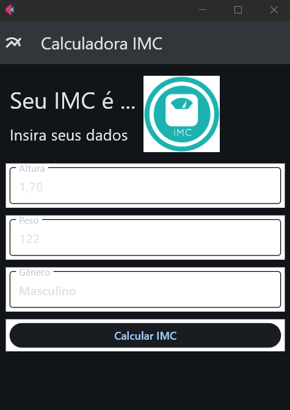
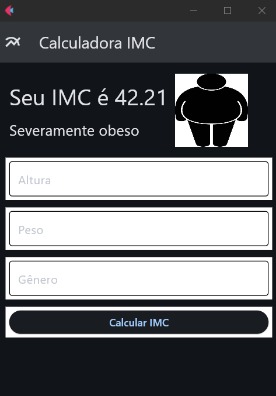
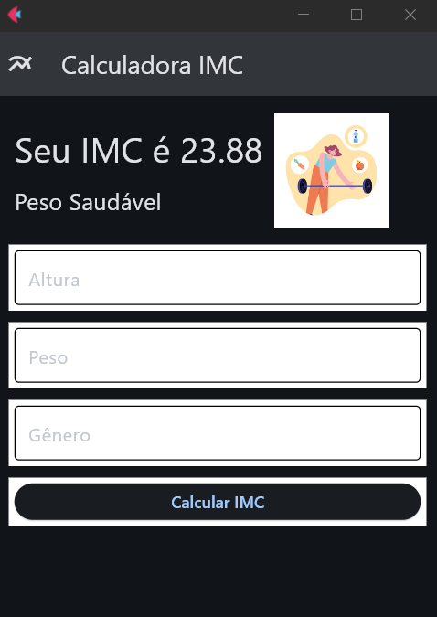

# CALCULADORA DE IMC COM FLET
👨‍🏫PROJETO CRIADO PARA O CURSO DE FLET.

 <br>
 <br>
 <br>

## DESCRIÇÃO:
Este projeto é uma aplicação de interface gráfica desenvolvida em Python utilizando a biblioteca Flet, que serve como uma calculadora de Índice de Massa Corporal (IMC). A calculadora IMC permite que os usuários insiram seus dados pessoais, como altura, peso e gênero, e fornece o valor do IMC junto com uma interpretação visual do resultado.

## FUNCIONAIDADES:
1. **Entrada de Dados:**
   - **Altura:** Campo de texto para inserir a altura do usuário em metros.
   - **Peso:** Campo de texto para inserir o peso do usuário em quilogramas.
   - **Gênero:** Dropdown para selecionar o gênero do usuário (Masculino ou Feminino).

2. **Cálculo do IMC:**
   - Botão "Calcular IMC" que, ao ser clicado, realiza o cálculo do IMC com base nos dados fornecidos.

3. **Exibição de Resultados:**
   - Exibe o valor calculado do IMC.
   - Mostra uma imagem correspondente à classificação do IMC (Abaixo do peso, Peso Saudável, Sobrepeso, Obeso, Severamente Obeso).
   - Fornece detalhes adicionais sobre a classificação do IMC.

4. **Notificações de Erro:**
   - Exibe um banner de notificação caso os campos de entrada não estejam preenchidos corretamente, alertando o usuário para preencher todos os campos.

5. **Interface Responsiva:**
   - Utiliza o layout responsivo da Flet para organizar os elementos de forma adequada em diferentes tamanhos de tela.

## COMO USAR?
1. **Instalando as dependências:**
   - Antes de executar o aplicativo, certifique-se de instalar todas as dependências necessárias. No terminal, execute o seguinte comando para instalar as dependências listadas no arquivo `requirements.txt` no diretório: `CODIGO`:
   ```bash
   pip install -r requirements.txt
   ```
   - Isso instruirá o pip a ler o arquivo requirements.txt e instalar todas as dependências listadas.

2. **Execução do Código:**
   - Execute o arquivo, no diretório `CODIGO`, usando o comando:
     ```sh
     python CODIGO.py
     ```

3. **Utilização da Aplicação:**
   - Ao iniciar a aplicação, uma janela será aberta com a interface da calculadora de IMC.
   - Insira sua altura no campo "Altura".
   - Insira seu peso no campo "Peso".
   - Selecione seu gênero no dropdown "Gênero".
   - Clique no botão "Calcular IMC".
   - O valor do seu IMC será calculado e exibido, juntamente com uma imagem correspondente e detalhes sobre a classificação do IMC.
   - Caso algum campo esteja vazio, um banner de notificação será exibido alertando para preencher todos os campos.

## CREDITOS:
- [PROJETO CRIADO PARA O CURSO DE FLET](https://github.com/VILHALVA/CURSO-DE-FLET)
- [PROJETO FEITO PELO VILHALVA](https://github.com/VILHALVA)


